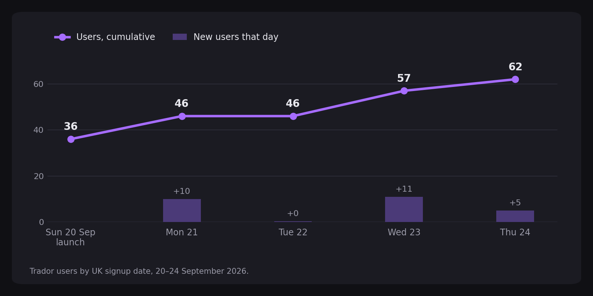
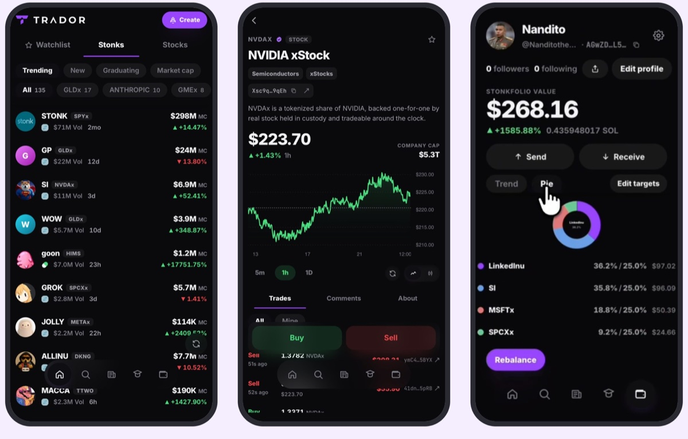

# Trador

**Live:** [https://www.trador.one](https://www.trador.one)


Coins priced in stocks, on Solana. Trador is the feed, chart, order ticket and
launchpad for that.

Two launchpads now let a creator pick a tokenized stock as the quote asset —
**StonkFun**, which runs on Raydium LaunchLab, and **pump.fun Custom Pairs**. So
a coin can be denominated in NVDAx instead of SOL, and a StonkFun reward launch
routes a share of every trade back to holders in stock.



Live since Sunday 20 September 2026. Users went from 36 at launch to 62 by
Thursday 24 September, by UK signup date.

```bash
cp .env.local.example .env.local
npm install
npm run db:migrate   # needs DATABASE_URL; skip if you are staying on the snapshot
npm run dev
```

It runs with no keys. Without Privy the session is a demo that cannot sign;
without Supabase the feed reads a captured snapshot of real launches. Charts,
the trade tape, news, search, the Stonkfolio and Jupiter quotes all work
keyless. The indexer and the probe scripts need an RPC that allows
`getProgramAccounts`, which public endpoints refuse.

## Vocabulary

**Stocks** are verified tokenized equities, ETFs, commodities and pre-IPO names —
things with a custodian behind them. **Stonks** are launchpad coins priced
against one. The two words stay distinct throughout because one of the two is
backed by an asset and the other is not, and a shared word would hide precisely
that. Your holdings are your **Stonkfolio**.

## Screens



Left to right: `/home` on the Stonks tab, the NVDAx stock page, and
`/stonkfolio` in pie view, each holding shown as actual share against target.

| Route | What it is |
| --- | --- |
| `/` | Landing, with real counts from the universe |
| `/home` | Watchlist / Stonks / Stocks, with per-tab sort rails |
| `/stonk/[mint]` | Chart, timeframes, live tape, comments, info, Buy/Sell |
| `/stock/[ticker]` | Same, plus issuer, sector and price-source honesty |
| `/u/[handle]` | Public profile and invite link |
| `/search` | Stocks and coins; a pasted mint resolves directly |
| `/news` | Coverage of the companies behind the stocks being traded against |
| `/learn` | Three lessons. Finishing them unlocks Create |
| `/stonkfolio` | On-chain holdings, split into stocks and stonks |
| `/create` | Plan, build and sign a launch against live chain state |

## What is live

| Surface | Source |
| --- | --- |
| Coin universe | Captured snapshot of real StonkFun launches; Supabase when configured |
| Prices, liquidity, 24h change | Jupiter |
| Candles, trade tape | GeckoTerminal, oriented by mint so the chart is never inverted |
| Market caps | Price × supply measured on chain. Never a guess |
| News | Yahoo per-ticker RSS, keyless |
| Stonkfolio | `getTokenAccountsByOwner` across both token programs |
| Quotes and swaps | Jupiter, 50 bps when the fee wallet is set, one signature. Leave the wallet unset and swaps run with no platform fee |
| Create | Plans, builds and signs against chain state. StonkFun / LaunchLab has launched a coin on mainnet; pump.fun Custom Pairs has not yet — see below |

The chain decides what exists. The store keeps it. Providers only decorate it.
If every provider is down the feed still renders without live prices.

## How it's built

| Piece | Role |
| --- | --- |
| Next.js | App Router UI and API routes, deployed on Vercel |
| Privy | Sign-in and transaction signing |
| Jupiter | Quotes and swaps |
| Supabase | Postgres store; the app reads through PostgREST, the worker writes over `DATABASE_URL` |
| Helius | Indexer RPC (`getProgramAccounts`) and parsed transactions |
| Railway | Always-on worker that discovers launches and keeps the universe growing |

### Program IDs

Printed exactly as `src/lib/programs.ts` spells them — case is meaning.

| What | Address |
| --- | --- |
| Raydium LaunchLab | `LanMV9sAd7wArD4vJFi2qDdfnVhFxYSUg6eADduJ3uj` |
| PumpSwap AMM | `pAMMBay6oceH9fJKBRHGP5D4bD4sWpmSwMn52FMfXEA` |
| StonkFun platform (rewards) | `6BwHHDg3u1854jC8PDLXvR4spTcLNaoBxLJNGC4nTESt` |
| StonkFun platform (standard) | `4E876qZTE9FJMrBzgVtBrSrzz2TLivB5Y5QXPjB4gZL7` |

## Membership

A coin is in Trador when it was launched by a program we recognise **and**
either its quote asset is a verified tokenized stock, or it is quoted in SOL or
a stablecoin and pays holders in a stock. Coins still on the bonding curve are
stored as `pending` and hidden; graduated coins are `listed`.

Attribution comes from program-owned account state, never from a token's name,
symbol or a listing site. A StonkFun launch is identifiable because its
LaunchLab pool records StonkFun's platform config. Jupiter reports a `launchpad`
field too and agrees with us on every coin in the snapshot — it is captured as a
cross-check, never as the authority.

## The stock registry is a trust boundary

`src/lib/stocks/mints.generated.json` decides which mints a coin is allowed to
claim a pairing against. A wrong entry is a laundering route: mint a token
called `OPENAI`, pair a coin to it, and the coin inherits a real asset's
credibility.

So the list is derived, not asserted. `npm run sync:stocks` censuses every
StonkFun pool, ranks mints by how many launches price against them, reads each
candidate's mint account, groups by **mint authority**, and emits only the
families whose authority is recognised. Two findings from that census are why
the authority is the test rather than a name or an address prefix:

- `xSOL` ("Hylo Leveraged SOL") is quoted against by 718 launches (as of
  2026-09-12) and would pass any prefix rule aimed at xStocks. It is a
  leveraged SOL derivative.
- `tOpenAI` sits in the census beside PreStocks' `OPENAI` under a different
  authority. Two tokens offering OpenAI exposure from two issuers. Names cannot
  separate them; authorities can, immediately.

Currently verified in the committed registry: **24** xStocks (one Backed mint
authority), **9** PreStocks (one PreStocks mint authority), **3** Tessera
(one Tessera mint authority — the same key mints and updates all three; a
second key freezes all three), and **64** Backpack Securities. Backpack is
proved by a single control key shared across freeze authority, Token-2022
metadata update authority, and permanent delegate on every mint — not by mint
authority, which is per-mint. The sync used to gate Backpack behind
`INCLUDE_BACKPACK=1`; it no longer reads that flag, and the committed JSON
already includes the family.

That count is mints the sync sees in the StonkFun census plus the live range
members of each verified issuer family — not a guarantee that every mint an
issuer has ever created is listed.

## Scripts

| Command | What it does |
| --- | --- |
| `npm run dev` | Dev server |
| `npm test` | Full suite, no network |
| `npm run typecheck` | `tsc --noEmit` |
| `npm run worker` | Always-on indexer loop (Railway) |
| `npm run db:migrate` | Apply `supabase/migrations/` in filename order |
| `npm run index:once` | One indexer pass into the store |
| `npm run backfill:graduated-at` | Pull `graduated_at` back to the pair's open time |
| `npm run cron` | Hit the deployed app's `/api/cron/*` routes |
| `npm run probe:accounts` | Read the mainnet accounts the build depends on |
| `npm run probe:quotes` | Census every quote asset StonkFun launches use |
| `npm run sync:stocks` | Regenerate the stock registry (`--write` to commit it) |
| `npm run seed:snapshot` | Recapture the universe snapshot |

Copy `scripts/git-hooks/*` into `.git/hooks/`; they strip AI co-author trailers from every commit message.

## Migrations

SQL lives in `supabase/migrations/`. Apply with `npm run db:migrate` against
`DATABASE_URL` (filename order, one transaction per file, safe to re-run). The
files, in order:

1. `0001_init.sql`
2. `0002_feed_view.sql`
3. `0003_portfolio_snapshots.sql`
4. `0004_curve_progress.sql`
5. `0005_notifications.sql`
6. `0006_graduated_at.sql`
7. `0007_discord.sql`
8. `0008_reclassify_links.sql`
9. `0009_wallet_trades.sql`
10. `0010_pool_kind.sql`
11. `0011_comment_likes.sql`
12. `0012_portfolio_public.sql`
13. `0013_referrals.sql`
14. `0014_coin_tapes.sql`
15. `0015_wallet_holdings_cache.sql`
16. `0016_trending_metrics.sql`
17. `0017_launch_signature.sql`

Without a database the app still runs on the captured snapshot. After migrate:
`npm run index:once` to fill the store.

## Two rules that are not negotiable

**Addresses are base58 and case-sensitive.** There is no normalisation step,
because there is nothing to normalise. Never `.toLowerCase()` a mint — `So111…`
and `so111…` are different strings and only one is an account. Folding case
corrupts silently: the lookup misses, or one mint's price is filed under
another's. `test/pubkey-lint.test.ts` enforces this, and it earned its place —
it caught five real case-folding bugs in code ported from the EVM app, including
one that would have filed one wallet's holdings under another's cache key.

**Nullable flags are three-state.** `true` show, `false` hide, `null` *not yet
evaluated* → **show**. Never `.eq(column, true)`. On Solana `eligible` also
carries confirmation state — a launch seen at `confirmed` is null until it
finalizes.

## Where pump.fun Custom Pairs actually live

Worth writing down, because the obvious place is the wrong one.

pump.fun's bonding curve is SOL-only and always has been — its `BondingCurve`
account carries no quote mint, and neither `create` nor `create_v2` accepts one.
Custom Pairs are a **PumpSwap AMM** feature: the `Pool` account holds `base_mint`
and `quote_mint` side by side, so a coin priced in NVDAx is a PumpSwap pool whose
quote mint is the stock.

Offsets were derived from the IDL and then confirmed against mainnet: a `memcmp`
for WSOL at `quote_mint` returns 146,685 pools (as of 2026-09-12), and the same
filter for a stock mint returns real stock-quoted pools whose base mint is a
pump.fun coin.

**Two account sizes are live and both matter.** 301 is current (142,317 pools as
of 2026-09-12), 245 is legacy (4,368 as of 2026-09-12). Fields were appended
rather than inserted, so the offsets are shared — which is exactly why pump pools
must not be filtered by `dataSize`. Pinning 245, the size the SDK types suggest,
would find the 4,368 oldest pools and silently miss 97% of the program including
every Custom Pair.

## Why Create signs on mainnet only

The Create screen resolves a real plan from chain state — the program, the
config that governs it, whether that config is owned by LaunchLab and names
StonkFun, the quote mint, the rent and fees — builds the instruction, and
signs. It is wired for both **StonkFun / LaunchLab** and **pump.fun Custom
Pairs**.

**pump.fun is not deployed on devnet**, so its create path can only be exercised
on mainnet with real SOL. LaunchLab has a devnet deployment, but its devnet
configs do not mirror mainnet's, so the stock-quoted path is not meaningfully
testable there either. That is why Create is not something you dry-run against a
free cluster: the only place the full path exists is mainnet.

The first coin through it launched on mainnet on **2026-09-22**. Every row below
is read back from the transaction and the pool account it created, not from the
app's own records.

| Field | Value |
| --- | --- |
| Coin | dickbutt (`DICKBUTT`) |
| Path | StonkFun on LaunchLab, rewards config `6BwHHDg3u1854jC8PDLXvR4spTcLNaoBxLJNGC4nTESt` |
| Quote asset | SPCXx, SpaceX xStock (Backed) |
| Mint | `4T4X6R2Ko34VXSoFfRmyYab5Y9sHJ75AEDkcKWo4feTG` |
| Transaction | [2G7ks6…1Uzui on Solscan](https://solscan.io/tx/2G7ks6LrnZCfrJ4nCGmHbUxHeNWvHxXxNT5Eh3uXpRmFzsPhGWD2pPVq4C9AsnCJx7WGAVwZN8XNzB7eNRG1Uzui) |
| Date | 2026-09-22 21:01:05 UTC, slot 449,493,720 |

The transaction proves a StonkFun launch on LaunchLab signed by the Create
wallet. The store did not record it as a Trador launch at the time; the confirm
route now saves the signature, so later launches are tagged in the store too.

The pump.fun Custom Pairs path is wired the same way but has not launched a coin
yet.
